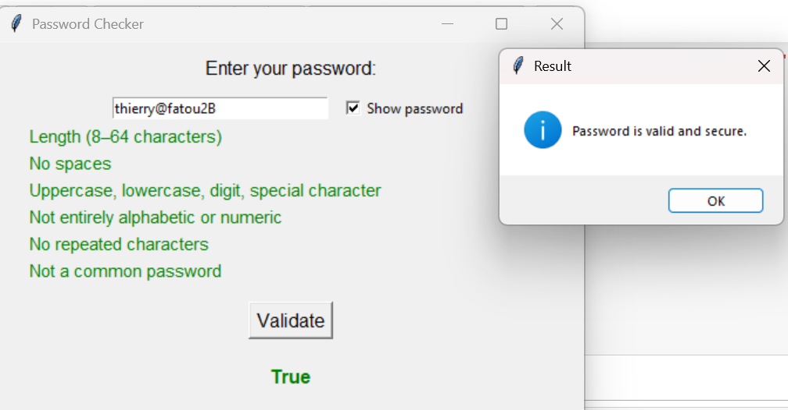
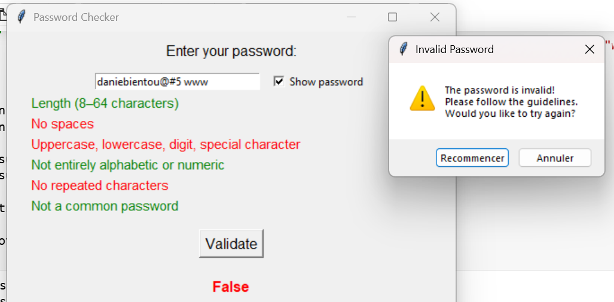

# Password-Checker-Group1-Project2
This project is a password validation interface built in Python. It helps users create secure passwords by checking multiple conditions and providing instant visual feedback.

## 🔍 Project Overview

The interface allows users to enter a password and immediately see which security rules are respected. Each rule is displayed with a label that turns green when the condition is met, or red when it fails. The goal is to guide users toward strong and safe password choices.

## ✅ Validation Rules

The password is evaluated against six conditions:
1. Length between 8 and 64 characters
2. No spaces allowed
3. Must include uppercase, lowercase, digits, and special characters
4. Cannot be only letters or only digits
5. No repeated characters (e.g. "aaa" or "111")
6. Must not be a common or weak password

# 📁 Files Included

- `Project2_groupe1.ipynb` — Jupyter Notebook with code and interface
- `Project2_groupe1.pdf` — Beamer presentation

## 🧠 How It Works

- The user types a password in the input field.
- The `verify()` function checks each rule and updates the labels.
- The `validate()` function confirms the final result and displays either `True` (valid) or `False` (invalid).
- The interface is built with Tkinter and designed for clarity and usability.

 ## Interface 

### ✅ Valid Password Example
This screenshot shows a password that meets all six conditions. The feedback is green, and the result is `True`.

### ❌ Invalid Password Example
This screenshot shows a password that fails two conditions: it contains spaces and repeated characters. The feedback is mixed, and the result is `False`.

## 👥 Team Members

This project was developed collaboratively by Group 1:
- Fatou Binetou Mbaye
- Kuate Mabap Thierry
- Barthelemy Ndecky
- Nguemtchueng Tsemo Danielle
- Ndeye Khady DIOP

## 🎯 Purpose

This project was created for an academic assignment focused on user-friendly design, modular code, and collaborative development. It demonstrates how to combine  backend logic with a graphical interface to improve user experience.

## 🙏 Special Thanks

We would like to thank our professor  **Dr Yaé Ulrich Gaba** for guiding us through this project and encouraging us to work as a team. This assignment helped us improve our coding skills and collaborative workflow.

